# All About Tea
Visit the live website [here](https://hpcarey.github.io/all-about-tea/)
## Site-Overview
All About Tea is a website dedicated to spreading information and education about tea and tea culture. It's purpose is to help popularise higher quality and healthier tea products, grown by small farmers and indigineous people, as well as to promote the more ceremonial and mindful tea practices that exist in eastern tea cultures, but which haven't quite taken off in the west yet. With meditation and mindfulness movements becoming more and more prominent in western society, All About Tea hopes to be one of the pioneering sources of the "Tea Movement" in the English speaking world. It's more immediate aim is to educate users and to build an online community around this somewhat niche hobby.

## Planning Stage

### Intended Users
The website is intended for a variety of users:
* Those who already have some knowledge and interest in tea and who wish to learn more and become involved in a global, online community who share the same interest.
* Beginners or "newbies" who have a curiosity and a desire to learn more about tea and tea culture, but who haven't yet developed this interest in a practical way.
* Those who are interested in higher quality tea for health reasons.
* Those who are looking for a meditative/mindful practice who have problems focusing and sitting in traditional meditation.

### User Stories
* As a visiting user, I want a quick, general intorduction to the topics.
* As a user, I want to be able to easily navigate to the section with the information I am seeking.
* As a user, I want to have learned something about the topic for which I visited the website.
* As a user, I want to be given navigation links to other resources that go more in depth on the topic that interests me most.
* As a user, I want the opportunity to connect with like-minded people and to become part of a community.

### Site aims
 1. The website will give users a general intorduction to tea related topics and will provide links to external sources and other websites for further education on each specific topic.   

2. The site will promote Tea Culture and encourage users to explore all aspects of tea, from the physical health benefits, to the meditative and ceremonial qualities as well as the taste experience of different varieties of tea.

3. The site will offer users the opportunity to become members and recieve monthly educational articles and updates of events and meetup opportunites (both online and face to face events) around the world. 

### Wireframes:
Although I know it was not a requirement, I used wireframes to help me visualise and conceptualise the features and layout of the website and it really helped me to create a solid image in my mind of how the webiste would function and look. It was also really useful in terms of getting feedback from my mentor on what would work and what wouldn't.

See [Wireframes.](docs/README-images/wireframes.pdf)

### Imagery
The images are a really important aspect of the site because they really help to set the tone and are a strong influence on the colour scheme which features earhty brown and green tones. 
* Images were taken from 
    * [Pixabay](https://pixabay.com)
    * [Unsplash](https://unsplash.com)
    * [Pexels](https://www.pexels.com)

* Images were formatted according to [this](https://www.jimdo.com/blog/optimize-website-images-for-better-design-seo/) article which is mentioned in the credits.

### Colour Scheme and Accessibility
 The first step for creating the colour scheme was to uplaod the hero image to [colormind](http://colormind.io/image/) and generate a few different palettes and copy the hex values.

 The next step was to go to input these hex values into the contrast grid on [Eightshapes](https://contrast-grid.eightshapes.com/) to check the WCAG 2.0 minimum contrast scores which helped me to pick a background and foreground colour that meet the accessibility requirements for good UX.

 

 

 

 ### Typography

 The first step for choosing the font was to got to [google fonts](https://fonts.google.com/) and type my website title to see which font had the style I was going for. I wanted something simple and with soft edges, so I ended up choosing Dosis.
 
Next I did a quick google search to see which fonts were commonly paired with Dosis.

 Finally, I used [pairfonts](https://pairfonts.com/) to decide which font I wanted to pair with it. I chose lato and with the intention of experimenting between regular and italicized. The clean lines and simplicity matched Dosis well and was the style I was going for with my website.

 ### Layout
 * The main content is on a single web page containging multiple sections which is the most appropriate for an information-based site
 * There are 2 other pages:
      * The Community page which provides information about the community, a sign up form and contact information, accessible via the navigation menu.
      * A form validation page which displays a thank you message upon correct form completion.
 

## Features
### Existing features
#### Navigation bar
* The navigation bar is featured on all pages of the site. 
* As much of the site is a single page the nav bar is sticky to aid navigation and I tried to make it as thin as possible so it doesn't interfere with the content too much.
* The nav bar is fully responsive and links to the Home, About, Tea and Community sections. 
* The Validation page can only be accessed once the form on the Community section has been filled in and submitted with the correct input type. 
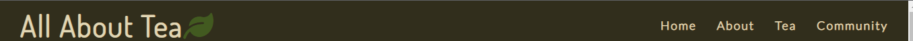

#### Logo
The logo also acts as a link to the homepage and is made up of the site name. It is part of the navigation bar and so is always on the screen as the navbar is sticky. 
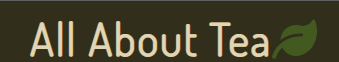
#### Footer 
* The footer is fully reposive and features at the bottom of each individual webpage.
* The footer contains external links to social media.
* All social media links open in a new tab and contain aria-labels for accessability.

#### Landing page
* The landing page features the hero image of a farmer's hand sifting through freshly picked tea leaves, which sets the tone and gives the user an idea of the kind of content the site provides. There is a zoom effect as seen in the Love Running walkthrough project.
* There is also a text overlay on the hero image giving a brief site overview and  inviting users to explore.
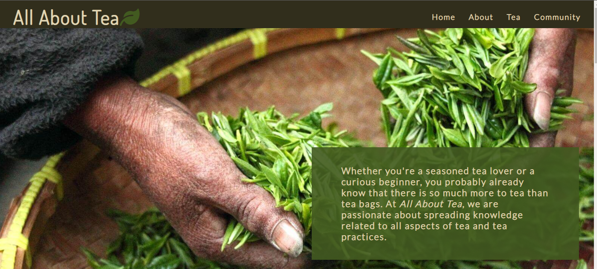
#### About section
The About section goes into more detail introducing the site to users and explaining what type of information and resources they will find.
*  The section begins with a tea mindfulness quote and then scrolls down to an embedded video again promoting tea mindfulness.

  * The main content is a short introduction to the 3 aspects of tea featured on the site and what kind of information to expect under each heading. 
  * The heading are also internal links to the part of the site related to that specific content. They have a hover feature to allow users to identify that they are links. This is more useful for the mobile and small screen structure as the content is divided put a bit more and there is a lot more scrolling involved. 
  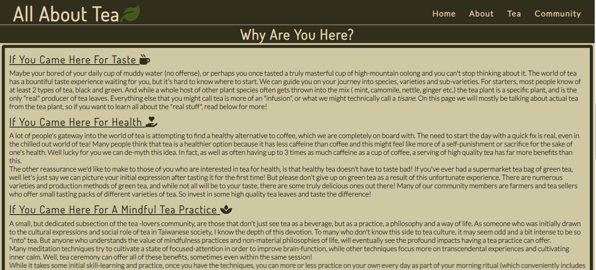

#### Tea
* This section contains the main content of the site and is divided into three parts; 

     * Tea varieties
     * Tea ceremony
     * Health
     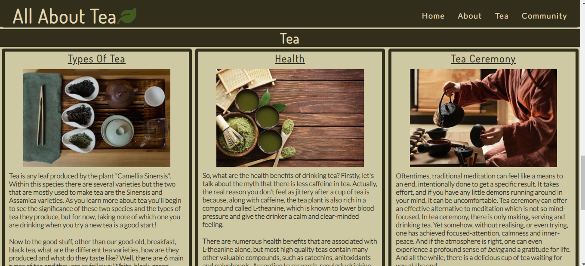

* Each part has a heading, an image and some text about the topic. Beneath the text are some links to external resources, such as articles and videos, related to the topic.
* The external links all open in a new tab, and like the internal links in the above "about" section, there is a hover feature where they change color and size to help users identify them as links.
* Aria-labels have been used to explain what the link is and that it will open a new tab for users using a screen reader. 
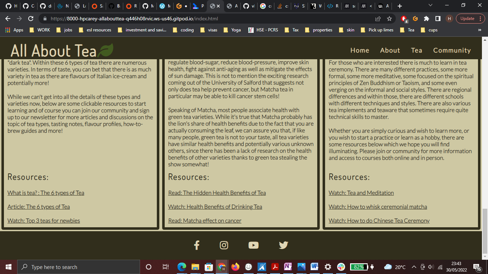
#### Community
* This section contains a second hero image as a background image to convey more clearly to the user that they have left the main page of the site and are on a new page.
*  Beneath there is a heading with a paragraph explaining about the community and how to get involved. 

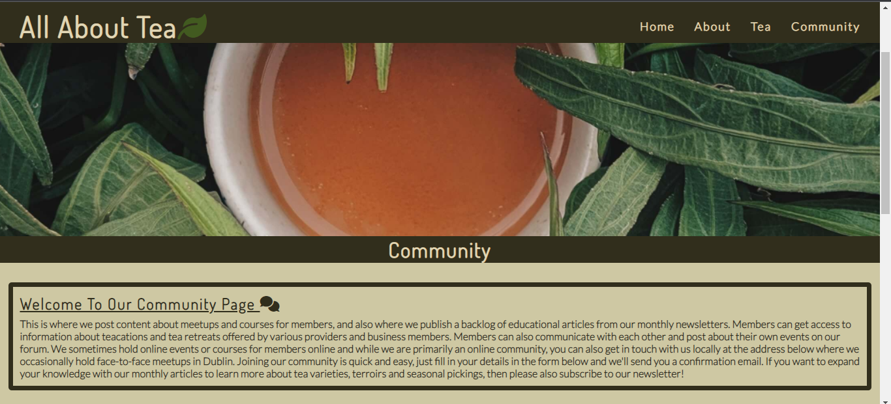
* There is form where users can become members to get accesss to past articles and newsletter as well as to the online All About Tea community chat and message board. 
    * The form contains 3 input fields for first name, last name and email address, which are required for form validation.

    * Within the form, users have the option to  subscribe to the monthly newsletter to receive news about tea production and sales, as well as events and featured articles. This is also a required field in the form of 2 radio buttons.

    * Lastly there is a submit button that will only validate the submission if all required fields have been filled in using the correct input type.

    * The user is taken to a validation page upon completing the form which has been set up using action="validation.html. No data is actually being collected.

* There is also a Contact section featuring an email, phone number and address for the base of operations in Dublin, as well as an embedded google maps location.  

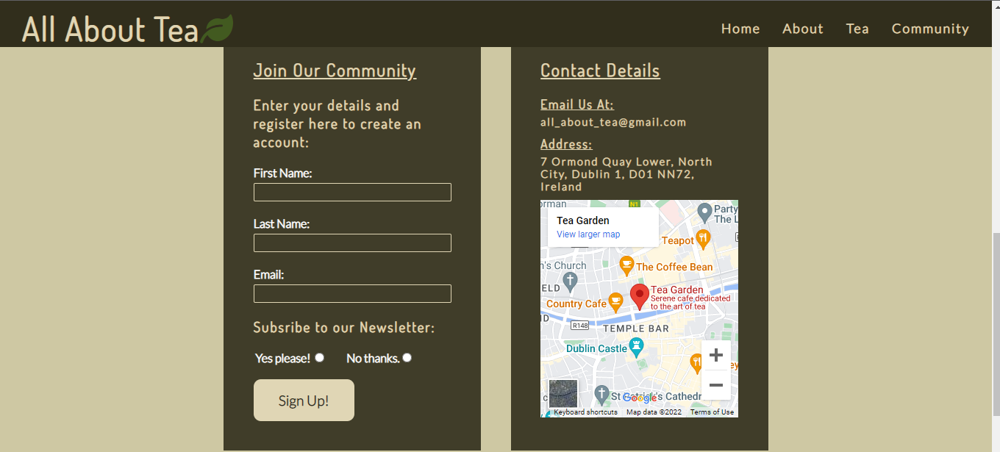

#### Validation page
* This page displays a "Thank You" message once users have signed up to become members. 
* It features the same hero image as the community page for consistency and to show the link between the two pages.
* Originally I was going to repeat some of the content from the community page and perhaps add an image, but in the end I liked the simplicity of the thank you message and repeating information from other pages seemed a bit redundant.

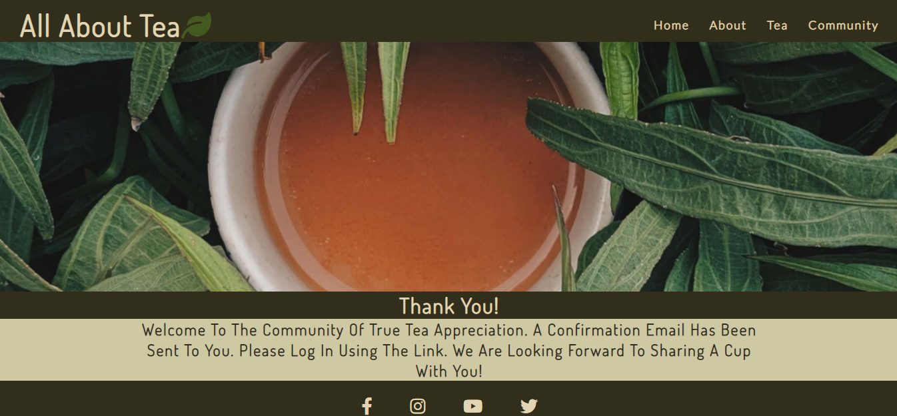

### Features left to implement
* As this is a community page and as suggested in the Community section, one of the features of this site would be a message board and live chat feature simialr to other social platforms such as slack.

 * As the community grows, there would also be an events page where members and businesses could promote their tea events and meetups.

* There is also potential for a products page where member and non-member users could purchase tea and teaware. 

* If the site were to be launched, the form could be made functional by adding a post request nce a database has been set up to collect data. 

## Technology
### Languages 
* HTML
* CSS
### Frameworks and Libraries
* [Font awesome](https://fontawesome.com/)
* [Pairfonts](https://pairfonts.com/)
* [Google fonts](https://fonts.google.com/)
* [Balsamiq](https://balsamiq.com/wireframes/)
* [Github](https://github.com/)
* [Gitpod](https://gitpod.io/)
* [Tiny PNG](https://tinypng.com/)
* [Pixabay](https://pixabay.com)
* [Unsplash](https://unsplash.com)
* [Pexels](https://www.pexels.com)
* [Eightshapes](https://contrast-grid.eightshapes.com/)
* [Colour Palette](docs/README-images/colour-palette.png)
* [rgbacolorpicker](https://rgbacolorpicker.com/hex-to-rgba)
* [Am I responsive](https://ui.dev/amiresponsive)

## Testing 
### User Stories
1. As a visiting user, I want a quick, general intorduction to the topics.
    * On the landing page, visiting users can read a quick overview of the site and the hero image also gives a visual idea.
2.  As a user, I want to be able to easily navigate to the section with the information I am seeking.
    * Users can navigate to specific sections of the site using the navigation menu.
    * Users can also navigate to specfic sub-sections using internal links in the about section which indicate the type of information in each subsection. This is especially useful for mobile users aas the site is single page and they can avoid a lot of scrolling and searching byt using these links.
3.  As a user, I want to have learned something about the topic for which I visited the website.
    * As well as site specific information on the topics, there are also external links providing resources for further learning and information underneath the relevant sections.
4. As a user, I want to be given navigation links to other resources that go more in depth on the topic that interests me most.
    * In order to effieciently meet users needs, external resources have been grouped with the specific topics of tea, health and mindfulness. Users can easily find and identify the external resources relevant to their needs.
5. As a user, I want the opportunity to connect with like-minded people and to become part of a community.
    * The community section provides users with the opportunity to connect with like-minded people.
    * The form in the community section gives users the opportunity to become members of the community and hence encourages visiting user to become frequent users.  

### Manual Testing
1. Navigation - Check this on all pages, inculding validation page.
    * Click on logo to confirm that it navigates to landing page and all navigation links to verify that they direct to the correct section.

    * Using chrome develper tools, verify that the navigation menu resizes to fit on all screen sizes and that all the navigation links remain visible and styled according to wireframes.
2. Landing page
    * Using chrome dev tools, verify that the text overlay re-sizes and shifts to be readable and look nice in all screen sizes.
    * Hero-image: Verify that the zoom animation works and the image looks centered in all screen sizes.

3. About

    * Check that the video fits all screen sizes and is responsive.
    * Make sure autoplay on the video is disabled.
    * check that all text elements are readable and responsive on all screen sizes.

4. Tea
    * Verify that flexbox items wrap in screens under 1030px.
    * Make sure contents are centered and responsive on all screen sizes, especially images.
   * Ensure that external links arclearly identifiable and that they open in a new tab. 
    * Ensure all non-textual elements on the page have sufficient aria-label descriptions. 

5. Community
  * Hero-image: Verify that the zoom animation works and the image looks centered in all screen sizes.
  * Verify that all textual elements are readable and responsive for all screen sizes.
  * Verify that the form works:
    * Verify that all elements that are set to required are working.
    * Enusre that the correct input value must be entered for form validation to occur, especially for email
    * Check that 'Submit' button directs user to the validation page.
 * Ensure that flexbox items wrap for screen sizes under 900px.
 * Ensure that content in flexbox items is responsive and centered in all screen sizes.    

6. Validation page
  * Hero-image: Verify that the zoom animation works and the image looks centered in all screen sizes.
  * Verify that all textual elements are readable and responsive for all screen sizes.
  * Check that navigation and footer links work the same as other pages.

7. Footer - Check this on all pages, inculding validation page.
    * Verify that the social media links open in a new tab.
    * Ensure footer is resonsive and stays at the bottom of the page.

### Code Validation
1. HTML
    * HTML validationwas done using [W3C Markup validator](https://validator.w3.org/)
    * Initial errors for the main page included:
        * a "section lacks heading" warning: 
            * This error is as a result of having a section for the hero image and styling the overlay text as a paragraph. Running this through the validator made me realise that this was not good semantic web practice and it would be better to label the text as a header and target the header for styling. This realisation was reinforced by my [lighthouse]() accessibilty results and I began to relaise that I was treating the headings too much as style rules and not enough semanitcally. This caused me to go back and re-label some headings and target them with specific css style rules instead of relying on the general heading style rules I had written in the css. 
        * a "bad value" for the embedded video for width 100%
            * I fixed this by removing width and height values from the iframe and styling the video in CSS instead.
        * an obsolete frameborder attribute for embedded video.
            * Fixed by removing the attribute. 
        * a stray end tag </i>
            * fixed by removing

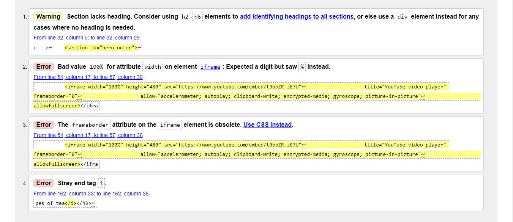

* Initial errors for the community and validation page were:
    * The same "section lacks heading" warning:
        * As I saw these errors and began to read about the [section element](https://developer.mozilla.org/en-US/docs/Web/HTML/Element/section) and the semantic importance of having a heading in a section, even if it's visually not required, I decided to give this hero-image section a hidden heading for semantic reasons. The heading is hidden by the content and this actually meets my visual preferences so I kept it like that.
    * There was also a small id and label error for the form element where they didn't match exactly.       

 
2. CSS
    * CSS Validation was done using [Jigsaw](https://jigsaw.w3.org/css-validator/)

    * [CSS validator results](http://jigsaw.w3.org/css-validator/validator$link)

    * No bugs were found in the CSS at the final tetsing stage as I had been testing throughout development and CSS bugs were common and obvious in the gitpod browser so were quickly identified and fixed.

3. Lighthouse
 * Initial results showed a good accessibility score but improvements could be made based on the order of headings, eg. using an h5 heading in a section without using an h4 element first. 
    * I fixed this issues by relabelling headings and targeting them for styling specifically in ths css. This improved the accesibility score as well as the best practice score to 100%.
* The performance results varied depending on how good my connection was at the time of running lighthouse. For desktop the results below range from 82 - 79 and 54 for mobile. The cause for these lower results seems to be loading time for images and embedded video. A quick analysis of this suggests using lazy loading configuration for the iframe. This issue is something I will have to think about more during the development stage next time.     

#### Lighthouse initial results
  

#### Lighthouse desktop final results
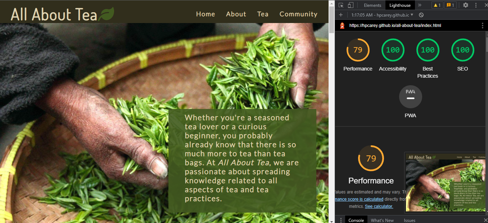

#### Lighthouse mobile final results
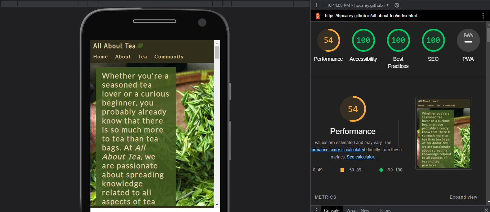

### Fixed bugs
I have detailed some of the sources I used to fix bugs in the Credit section. Some of the main issues that were resolved were:
* Centering content in flexbox items
* Making flexbox items equal width despite content amount.
* Pusing content to the bottom of a flex item.
* Ensuring flex items wrap under 1030 px depsite display: flex, flex: 1; being applied to make flex items equal width. 
* A horizontal scroll bar which was the result of using a fixed width on elements instead of using ems or %.
* A footer bug on the community page occured for a while. I could not fix it by targeting the footer alone, so I commented it out and worked on the other features on the page, making them responsive and adjusting them to fit the page better. When I commented the footer back in it stayed at the bottom of the page where it should be. 

### Unfixed bugs
* The font size of links changes because of pseudo hover class in order to make links more visible to the user, however the size change affects the other content and causes things to jump around. 
* The navbar loses it's structure below 280 px. This is really narrow so it doesn't require urgent attention but would be worth looking into howto maintain navbar structure asa much as possible. 
* Since changing the video width and height properties by moving them from the embedded link to css, the thumbnail image for the video is slightly cut off on smaller screens. The video itself is fine, but I wouls like to fix this thumbnail issue.

### Screens and Browsers
* The site was tested in chrome, firefox and microsoft edge browsers

## Deployment 

This website was deployed via Github pages via the folowing steps:

1. Navigate to the Settings tab in the GitHub repository for the project.
2. Find the pages tab from the left-hand menu and select.
3. Under the Source tab, select the branch called Main the folder called Root.
4. Click save and the page displays the deployement link.
5. It can take up to 5 minutes to deploy.

Here is a link to the live [site](https://hpcarey.github.io/all-about-tea/).

## Credit
The following resources were essential for teaching me about general implementation and for fixing specific bugs:

* How to implement a Sticky Nav : [w3schools](https://www.w3schools.com/howto/howto_js_navbar_sticky.asp)

* How to align items in flexbox (This helped me solve several alignment issues with flex content including how to center the images in a display flex container a): [MDN](https://developer.mozilla.org/en-US/docs/Web/CSS/CSS_Flexible_Box_Layout/Aligning_Items_in_a_Flex_Container)

* How to push items to the bottom of the page with margin: 0 auto; [culture foundry](https://www.culturefoundry.com/cultivate/technology/bottom-align-an-element-with-flexbox/)

 * How to get flex items to wrap after making them display: flex; flex: 1; for equal width: [Stack Overflow](https://stackoverflow.com/questions/44135352/flex-wrap-is-not-wrapping-when-i-reduce-the-window-size)

 * How to make your flex items the same width : [Stack Overflow](https://stackoverflow.com/questions/29503227/how-to-make-flexbox-items-the-same-size) 
 [Tutorial](https://www.google.com/search?q=how+do+you+make+your+flex+items+the+same+size&oq=how+do+you+make+your+flex+items+the+same+&aqs=chrome.1.69i57j33i160l4.17209j0j7&sourceid=chrome&ie=UTF-8#kpvalbx=_O9WRYuqNDuKWseMPnbe74Ag18)

 * How to introduce smooth transition for hover features [iqcode.com]( https://iqcode.com/code/css/css-text-larger-on-hover*/)

* How to use :active pseudo class : [W3schools](https://www.w3schools.com/cssref/sel_active.asp)

### Sources I used to teach myself the basics of flexbox:

[Flexboxsheet.](docs/README-images/flexboxsheet.pdf)

[Flex box tutorial](https://www.youtube.com/watch?v=JJSoEo8JSnc)

[Flex box and grid](https://www.youtube.com/watch?v=R7gqJkdc5dM)

[flexbox navbar](https://www.youtube.com/watch?v=yXhfUCXy2j4&ab_channel=WhatMakeArt)

I should also give credit to the Code Institute love running walkthrough project, which was the inspiration for my landing page including the zoom feature on the hero image and the structure of thenav bar using float.

### Articles
Articles that helped me with other aspects of the site:

#### Images:
[Jimdo](https://www.jimdo.com/blog/optimize-website-images-for-better-design-seo/): Article on how to prepare images for assets folder

#### Good Practice:
[Section element](https://developer.mozilla.org/en-US/docs/Web/HTML/Element/section): Article on the semantic importance of headings and sections

### Media and site content
All site content was written by me but I took inspiration from some of my own favourite sites on the topic. These sites have also been linked as resources on the webpage. All credit goes to them.

[Meileaf](https://meileaf.com/)

[Global Tea Hut](https://globalteahut.org/)

[Mansatea](https://mansatea.com/blogs/learn/types-of-tea)

[Pennmedicine.org article](https://www.pennmedicine.org/updates/blogs/health-and-wellness/2019/december/health-benefits-of-tea#:~:text=Numerous%20studies%20have%20shown%20that,lasting%20impact%20on%20your%20wellness.)

[drugtargetreview.com article](https://www.drugtargetreview.com/news/34751/matcha-green-tea-cancer/#:~:text=%E2%80%9CThe%20effects%20on%20human%20breast,metabolic%20reprogramming%20of%20cancer%20cells.%E2%80%9D)

The embedded map in the contact section is actuall a real location, but it's not related to this site or me, it's just another tea-based compant that I like so I will credit it here:
[Tea Garden](https://www.teagarden.ie/)

### Thanks
A big thanks to the slack community and all the tutors and members that helped out and reviewed my site.

A big thanks to my mentor Rohit Sharma for his advice and guidance on this project.